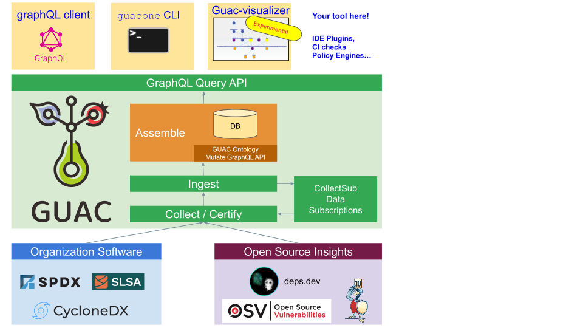

# How GUAC components work together
{: .no_toc }

@@ -18,11 +18,92 @@ nav_order: 1
{:toc}

The full GUAC component deployment is a set of asynchronous services that
combine to form a robust and scaleable pipeline. In some of our [demos](https://docs.guac.sh/guac-use-cases/), you may have seen
these components work in concert. Read on to learn more of what
goes on behind the hood!

## GUAC Components

### GraphQL Server

The GraphQL server serves the GUAC defined nodes through GraphQL queries. It is
an abstraction layer for GUAC integrations and other GUAC components. Our setup docs
use the built-in, in-memory backend for the server. Currently the
server also supports a Neo4j backend. Any future backend database support added
to GUAC will not affect the GraphQL interface that the server provides.

### Ingestion Pipeline

| Name       | Short Description                                                                  |
| ---------- | ---------------------------------------------------------------------------------- |
| Collector  | Reads or watches locations for new documents and collects them when found          |
| Ingestor   | Takes documents (ex: SBOMs) and parses them into the GUAC data model/ontology      |
| Assembler  | Takes GUAC objects and puts them in a datastore, queryable by the GraphQL server   |
| CollectSub | Takes identifiers of interest and creates a subscription for collectors to follow  |

#### Collectors 

Collectors gather data from various sources. These sources can be internal to
the organization, public (like open source), or third-party
vendors. There are different collectors for the different types of locations
that GUAC can watch (files, storage buckets, git repositories, etc.).

Collectors can be configured to use a CollectSub service to know which
data sources are of interest. For example, a git collector may subscribe to the
CollectSub service to know which git repositories it should get its data from.
This is a way to get an idea of what data sources the
instance of GUAC is looking at, at a glance.

Collectors and certifiers then take the documents and pass them onto the
ingestor via [Nats](https://nats.io/).

##### Certifiers

Another class of GUAC collector components are certifiers. Certifiers run
outside the server, but are not part of the ingestion pipeline. They watch the
server for new nodes in the server and add additional information
attached to those nodes.

For example, the [OSV](https://ossf.github.io/osv-schema/) certifier will watch
GUAC for new packages, then try to discover OSV vulnerabilities for those
packages. If any vulnerabilities are found, the certifier will attach a
"CertifyVuln" node to the package to signify that the package is connected
to the OSV vulnerability.

#### Ingestor

Ingestors take in documents and parse them into the [GUAC data model/ontology](https://docs.guac.sh/guac-ontology/).
This process extracts meaning from documents and translates them into a common reasoning
model (GUAC ontology). In the process, it also finds identifiers of interest that it passes to the CollectSub service to request additional information for.

Today, GUAC can understand multiple data formats like SPDX, CycloneDX, and SLSA. The ingestor listens for documents to parse via [Nats](https://nats.io/),
and talks to the assembler via a GraphQL API.

#### Assembler

The assembler takes the parsed GUAC ontology objects from the ingestor and
creates entries within a database. This database is used as a source of truth for GUAC
queries.

The assembler exposes a set of GraphQL mutate interfaces. The assembler is physically part
of the GraphQL server, but logically part of ingestion.

#### CollectSub

The collect subcriber service provides a way to ask for a datasource to be used or indicate that more data about a software identifier is desired. For example, in parsing an SBOM, if it sees the use of a package with a PURL,
the ingestor creates an entry to the CollectSub service to indicate more
information about the PURL is desired (via gRPC).

The collectors all subscribe to this service and will automatically retrieve
more information about the PURL (or other identifier/datasource) if they know how
to handle it. For example, the deps.dev collector knows how to handle
PURLs and retrieves more information about the PURL entries created from
the ingestor parsing the SBOM.
